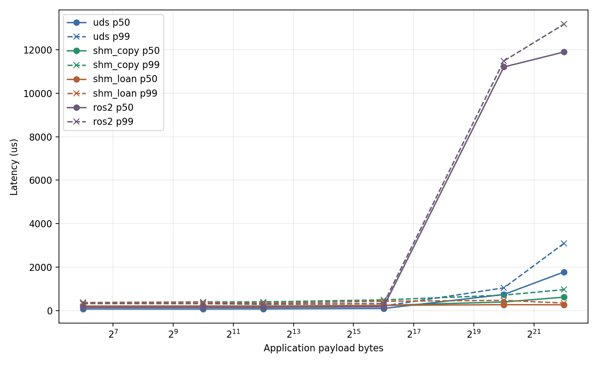
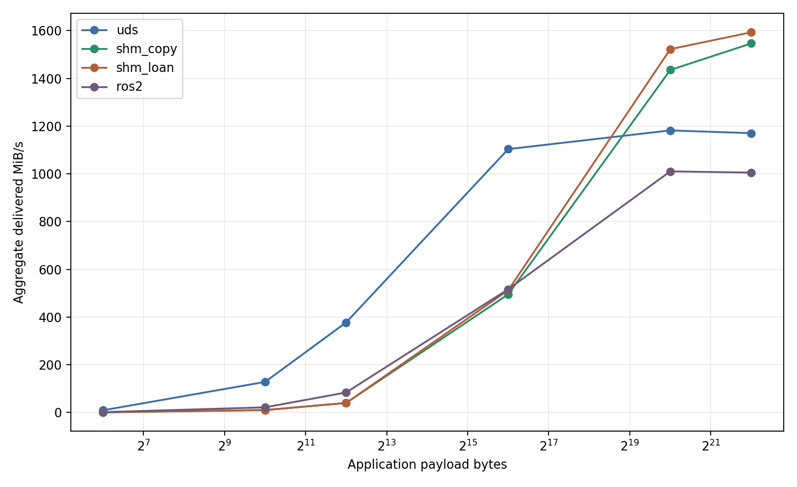
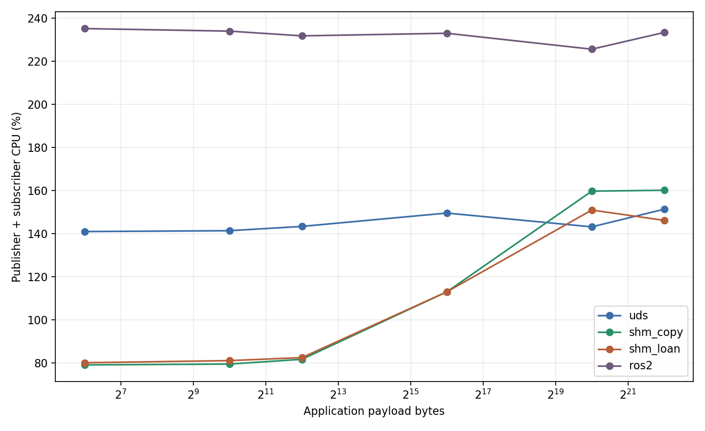
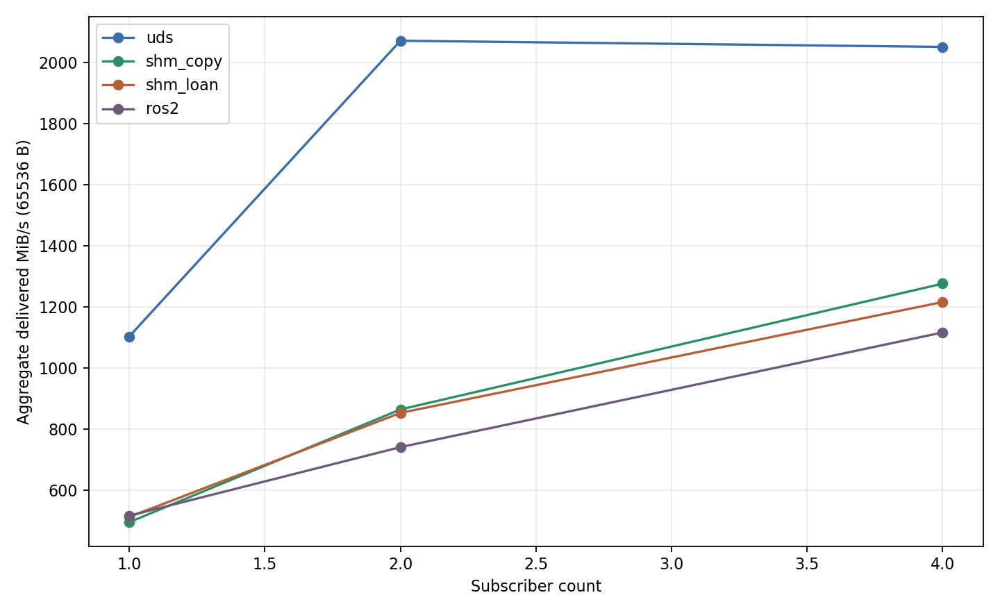

# cpp_robot_middleware

## Project Overview

`cpp_robot_middleware` is a Linux and C++17 project for building a small, explainable,
testable, and benchmarkable local multi-process publish/subscribe middleware for robotics.
The middleware core is designed as an independent C++ library rather than a ROS2 component.

## Why This Project

Robot applications exchange both small control messages and large sensor payloads. This project
provides a focused environment for studying the IPC, resource-lifetime, backpressure, and
performance tradeoffs beneath a robotics communication API without implementing a full DDS or
ROS2 RMW stack.

## Current Status: Phase 8.1 - Profiled And Optimized

Phase 8 adds a reproducible cross-process benchmark for custom UDS, SHM copy, SHM loan, and direct
ROS2 Jazzy with `rmw_fastrtps_cpp`. It covers six exact payload sizes, 1-to-1/2/4 topologies,
latency and throughput profiles, process CPU/RSS, correctness/loss accounting, repeated
aggregation, backpressure, and deterministic plots. The middleware core remains ROS2-independent.
Phase 8.1 profiles representative cases, removes per-message SHM registry resolution by using a
1 ms bounded discovery refresh, and drains redundant SHM wake notifications without changing the
bounded queue or backpressure policy.

## Architecture Direction

The architecture separates the `mw_registryd` UDS control plane from publisher-to-subscriber data
transfer. Registry protocol v5 distributes pool metadata plus each subscriber's queue descriptor
without owning payload memory or queue storage. Direct mode retains the Phase 1 UDS baseline. The
core library remains independent of ROS2. The dependency direction is exclusively
`mw_ros2_adapter -> mw::mw_core`.

## Implemented

- C++17 `mw_core` shared library with install/export packaging
- `Context`, move-only `Publisher`, and move-only `Subscriber`
- Direct UDS mode and explicit registry-discovery mode
- `mw_registryd` single-threaded `epoll` control server
- Node registration and clean unregistration
- Topic advertisement/subscription and clean endpoint removal
- `node_id`, `topic_id`, and `endpoint_id` assignment
- Exact `type_name` plus `type_hash` compatibility and one-active-publisher enforcement
- Publisher-first and subscriber-first endpoint discovery
- `mwctl node list`, `topic list`, and `topic info`
- `TransportType::UnixDomainSocket` and `TransportType::SharedMemory`
- Registry transport compatibility checks and SHM discovery metadata
- Move-only `SharedMemoryRegion` ownership for `shm_open`, `ftruncate`, `mmap`, and `munmap`
- One preallocated POSIX SHM pool per SHM publisher lifetime
- Configurable 256 B, 4 KiB, 64 KiB, 1 MiB, and 4 MiB chunk classes
- Checked pool/class/directory layout and aligned `ChunkHeader`
- Mutex-protected publisher-owned per-class free lists
- Generation-protected logical chunk handles and explicit lifecycle state
- Publisher-owned reference decrement from exactly-once subscriber release frames
- One shared SHM payload, N bounded handle queues, and fixed metadata wakes/releases
- One subscriber-owned fixed-capacity SHM ring queue per SHM endpoint
- Per-subscriber `DROP_NEWEST`, `DROP_OLDEST`, and monotonic `BLOCK_WITH_TIMEOUT`
- Queue wraparound, empty/full handling, wake coalescing, and internal queue counters
- Publisher guard reference preventing enqueue-versus-reclaim races
- `Publisher::loan()` and move-only RAII `LoanedSample`
- Cancellation of unpublished loans, move ownership, and double-publish protection
- Move-only, read-only RAII `SampleView`
- `Subscriber::takeView()` and `waitAndTakeView()` without an owning payload copy
- Shared view release context allowing `SampleView` to outlive `Subscriber`
- Retained SHM copy path through `Publisher::publish()` and owning receive compatibility
- Persistent subscriber pool mapping and publisher-owned normal-path `shm_unlink`
- Fixed 24-byte frame header plus copied payload
- Strict sequence and monotonic publish timestamp metadata
- Empty, small, and large payload support up to the configured bound
- Partial read/write and `EINTR` handling
- Timeout, invalid-frame, disconnect, and subscriber reconnect behavior
- Unit, in-process integration, and cross-process integration tests
- Registry heartbeat thread with configurable monotonic interval/suspect/dead timeouts
- ALIVE, SUSPECTED, and terminal DEAD node state with unique session identity
- Immediate primary control EOF/HUP cleanup plus heartbeat timeout detection for open sockets
- Exact dead publisher pool and dead subscriber queue/socket cleanup through the registry
- Bounded per-endpoint outstanding handle tracking and exactly-once release repair
- Robust process-shared queue mutex owner-death recovery and blocked-producer wakeup
- Publisher and subscriber reconnect after peer `SIGKILL`, including replacement endpoints
- Independent `mw_ros2_adapter` ament package consuming the installed core package
- `ros2_to_mw_bridge` and `mw_to_ros2_bridge` executables
- Explicit String, Twist, and Image dispatch through `rclcpp::Serialization<T>`
- Canonical ROS type names plus stable versioned adapter wire identifiers
- SHM adapter transmit through `LoanedSample` and receive through `SampleView`
- UDS adapter compatibility through the owning middleware API
- ROS parameter configuration, launch file, and six-section YAML examples
- Bidirectional real-process ROS2 integration tests, including a 1280x720 RGB8 Image
- Real `ros2 topic pub --once`, normal cleanup, and bridge `SIGKILL` cleanup coverage
- Registry-discovered UDS fanout to 1, 2, or 4 independent subscriber processes
- Separate UDS, SHM copy, SHM loan, and direct ROS2 benchmark endpoints
- Exact-size deterministic payload envelope with monotonic one-way latency validation
- Fixed-rate latency and maximum-rate throughput profiles with bounded raw sampling
- Automated warmup, measurement, cooldown, readiness, monitoring, and exact child cleanup
- `/proc` measurement-window process CPU ticks and periodic mean/peak RSS collection
- Per-run correctness, loss, throughput, latency, CPU, RSS, overflow, allocation, and block metrics
- Three-repetition median/min/max aggregation and deterministic JSON/CSV/PNG output
- Focused slow-subscriber comparison of all three SHM backpressure policies
- Representative Phase 8.1 `/proc` profiling with explicit perf/strace availability records
- Bounded SHM discovery reuse with immediate refresh after connection or peer failure
- Nonblocking drain of redundant SHM queue wake notifications
- Complete optimized 441-run matrix and compact Phase 8.1 reference artifacts

## Build

```bash
cmake -S . -B build -DCMAKE_BUILD_TYPE=Debug
cmake --build build -j
```

The build produces `libmw_core.so`, `mw_registryd`, `mwctl`, and the ping demos.

## Test

```bash
ctest --test-dir build --output-on-failure
```

## Registry Quick Start

Start the registry:

```bash
./build/bin/mw_registryd
```

Start the subscriber in either order relative to the publisher:

```bash
./build/bin/mw_ping_subscriber \
  --registry /tmp/mw_registry.sock \
  --socket /tmp/mw_ping.sock \
  --transport shm \
  --count 10 \
  --size 64
```

In another terminal, run the publisher:

```bash
./build/bin/mw_ping_publisher \
  --registry /tmp/mw_registry.sock \
  --socket /tmp/mw_ping.sock \
  --transport shm \
  --count 10 \
  --size 64
```

Inspect the live registry with:

```bash
./build/bin/mwctl node list
./build/bin/mwctl topic list
./build/bin/mwctl topic info /ping
```

Use `--transport uds` for the registry-discovered copied-payload baseline; omit `--registry` for
direct UDS mode. See [docs/FAILURE_MODEL.md](docs/FAILURE_MODEL.md) for liveness, crash, and cleanup
behavior, [docs/DATA_PLANE.md](docs/DATA_PLANE.md) for both payload paths,
[docs/CONTROL_PLANE.md](docs/CONTROL_PLANE.md) for discovery,
[docs/MEMORY_POOL.md](docs/MEMORY_POOL.md) for the pool layout, and
[docs/QUEUES_AND_LOANING.md](docs/QUEUES_AND_LOANING.md) for queue/RAII lifecycles.

## ROS2 Adapter

Build and install the core before building the independent ROS2 package:

```bash
cmake --install build --prefix "$PWD/_install"
source /opt/ros/$ROS_DISTRO/setup.bash
colcon --log-base log_ros2 build \
  --base-paths ros2_adapter \
  --build-base build_ros2 \
  --install-base install_ros2 \
  --cmake-args "-DCMAKE_PREFIX_PATH=$PWD/_install;/opt/ros/$ROS_DISTRO"
source install_ros2/setup.bash
```

Run a bridge with ROS parameters or use the installed launch file:

```bash
ros2 launch mw_ros2_adapter bridge.launch.py \
  direction:=ros2_to_mw_bridge \
  ros_topic:=/robot/text/in \
  mw_topic:=/robot/text \
  message_type:=std_msgs/msg/String \
  transport:=shm
```

See [docs/ROS2_ADAPTER.md](docs/ROS2_ADAPTER.md) for parameters, YAML examples, bidirectional
demos, type compatibility, shutdown behavior, and exact serialization/copy boundaries.

## Automated Benchmark

The mandatory matrix is four transports x six sizes x three topologies x two profiles x three
repetitions: 432 main runs. The full runner also executes nine focused backpressure runs. Sizes are
exact application byte counts: 64 B, 1 KiB, 4 KiB, 64 KiB, 1 MiB, and 4 MiB. Every subscriber is
an independent process. The direct ROS2 baseline uses `std_msgs/msg/UInt8MultiArray` and never
passes through the Phase 7 adapter.

Build both Release benchmark packages, source ROS2, and run smoke or full automation:

```bash
cmake -S . -B .work/phase_8/build_release \
  -DCMAKE_BUILD_TYPE=Release -DBUILD_TESTING=OFF
cmake --build .work/phase_8/build_release -j

source /opt/ros/jazzy/setup.bash
export RMW_IMPLEMENTATION=rmw_fastrtps_cpp
colcon --log-base .work/phase_8/ros2/log build \
  --base-paths benchmark/ros2 \
  --build-base .work/phase_8/ros2/build \
  --install-base .work/phase_8/ros2/install \
  --cmake-args -DCMAKE_BUILD_TYPE=Release

python3 benchmark/python/run_benchmarks.py \
  --config benchmark/configs/smoke.json
python3 benchmark/python/run_benchmarks.py \
  --config benchmark/configs/full.json
```

Warmup/discovery and cooldown are excluded from the steady-state window. Full defaults are 2
seconds warmup, 5 seconds measurement, 1 second cooldown, queue depth 8, and three repetitions.
Results retain median/min/max rather than selecting a best repetition. Process CPU comes from
measurement-boundary `/proc/<pid>/stat` tick deltas; RSS is sampled from `/proc/<pid>/status`.

See [docs/BENCHMARK.md](docs/BENCHMARK.md) for transport boundaries, fairness, payload/timestamp
definitions, all metrics, one-case commands, result schema, interpretation, and limitations.
Compact measured results and the four selected plots are recorded in
`benchmark/results/phase8_reference/` and analyzed in
[`docs/reports/PHASE_8_REPORT.md`](docs/reports/PHASE_8_REPORT.md).

### Measured Results Summary

The committed Release run used Git revision `cf353091f7149ac4f458ec77d98f23bb948155b2`
on WSL2 with an Intel i5-8300H, ROS2 Jazzy, and `rmw_fastrtps_cpp`. All 432 main and 9
backpressure runs were valid. Across the main matrix, payload errors, duplicate/out-of-order
sequence errors, custom transport drops, queue timeouts, and allocation failures were zero; the
focused backpressure runs intentionally triggered policy drops/timeouts.

Selected 1-to-1 medians show the size-dependent crossover. Latency is fixed-rate p50 in
microseconds; throughput is correct delivered MiB/s at maximum rate.

| Size | Metric | UDS | SHM Copy | SHM Loan | ROS2 |
| ---: | --- | ---: | ---: | ---: | ---: |
| 64 KiB | p50 us | 103.7 | 245.6 | 247.1 | 181.5 |
| 64 KiB | MiB/s | 1103.5 | 495.0 | 512.3 | 516.4 |
| 1 MiB | p50 us | 747.0 | 403.3 | 278.9 | 11206.0 |
| 1 MiB | MiB/s | 1181.9 | 1435.1 | 1522.4 | 1010.2 |
| 4 MiB | p50 us | 1781.4 | 623.0 | 272.5 | 11895.9 |
| 4 MiB | MiB/s | 1170.3 | 1546.3 | 1593.1 | 1005.1 |

On this run, UDS led both SHM paths through 64 KiB. SHM crossed over at 1 MiB; at 4 MiB, SHM
Copy/Loan p50 was 2.86x/6.54x lower than UDS and delivered throughput was 32%/36% higher. Loan
changed little at small sizes, while its 1 MiB/4 MiB p50 was 1.45x/2.29x lower than Copy. At
64 KiB, aggregate delivery from 1 to 4 subscribers rose 1.86x UDS, 2.58x Copy, 2.37x Loan, and
2.16x ROS2 while publisher logical throughput declined for every transport.

Direct ROS2 maximum-rate cases recorded finite-history sequence gaps, including 3.80% drop at
64 KiB 1-to-1 and 9.83% at 1-to-4; only correct delivery is reported above. Fixed-rate latency
was effectively loss-free. These observations are measurements, not Phase 8.1 bottleneck
attributions.

### Selected Charts









The complete p50/p90/p99, messages/s, logical/delivered throughput, per-process CPU/RSS,
drop/overflow/allocation/block metrics, min/max repetition ranges, and backpressure analysis are
in [docs/reports/PHASE_8_REPORT.md](docs/reports/PHASE_8_REPORT.md).

Phase 8.1 profiling evidence is in [benchmark/profiling/](benchmark/profiling/), the optimized
compact matrix is in [benchmark/results/phase8_1_reference/](benchmark/results/phase8_1_reference/),
and the interpretation and acceptance record are in
[docs/reports/PHASE_8_1_REPORT.md](docs/reports/PHASE_8_1_REPORT.md).

## Install

```bash
cmake --install build --prefix "$PWD/_install"
```

The installed CMake package exports the shared library as `mw::mw_core` and installs public headers
under `include/mw`.

## External Consumer

The standalone example consumes only the installed package:

```bash
cmake -S examples/external_consumer -B build_external \
    -DCMAKE_PREFIX_PATH="$PWD/_install"
cmake --build build_external -j
./build_external/mw_external_consumer
```

An external CMake project uses the package with:

```cmake
find_package(mw CONFIG REQUIRED)
target_link_libraries(example PRIVATE mw::mw_core)
```

## Development Phases

- Phase 0: Project skeleton and CMake library packaging.
- Phase 1: Unix Domain Socket publish/subscribe baseline.
- Phase 2: Registry, discovery, and `mwctl`.
- Phase 3: Shared-memory data plane V1.
- Phase 4: Memory pool, chunk lifecycle, and multiple subscribers.
- Phase 5: Ring buffer, backpressure, and loaned samples.
- Phase 6: Heartbeat, crash recovery, and resource cleanup.
- Phase 7: ROS2 adapter (complete).
- Phase 8: Automated benchmark (complete).
- Phase 8.1: Profiling and evidence-based optimization (complete).
- Phase 9: Final documentation and demos.

## Known Limitations

- UDS fanout establishes connections from discovery state present before publication; it does not
  add a dynamic data-plane worker or reliable retransmission protocol.
- UDS notifications remain in use; `eventfd` and `SCM_RIGHTS` optimizations are deferred.
- The heartbeat lease covers process liveness while the registry daemon is running; it does not
  cover distributed hosts, kernel failure, power loss, or arbitrary memory corruption.
- The ROS2 adapter supports only String, Twist, and Image; it has no dynamic introspection or
  complete ROS schema-evolution system.
- The ROS2 serialized bridge path allocates/copies adapter buffers and is not end-to-end zero-copy.
- Phase 8 measures one host session without CPU affinity, scheduler priority, system-load control,
  or hard real-time guarantees; it does not attribute bottlenecks without Phase 8.1 profiling.
- Direct ROS2 uses `UInt8MultiArray` with normal `rmw_fastrtps_cpp` behavior. Its Reliable KeepLast
  setting and middleware `BLOCK_WITH_TIMEOUT` are not semantically identical QoS guarantees.
- Throughput-profile latency uses documented systematic sampling and is not a complete tail
  distribution.
- Registry requests are synchronous and are not multiplexed across application threads.
- The UDS path copies payload data through kernel socket buffers and is not zero-copy.
- Ordinary SHM `publish()` copies into the pool, and owning `ReceivedMessage` copies from a
  `SampleView`; only the explicitly verified loan-to-view path avoids middleware payload copies.
- Recovery is limited to registry-known names and endpoint state; the daemon does not scan arbitrary
  `/dev/shm` or `/tmp` entries.
- A failed heartbeat control connection is not reconnected inside an existing `Context`; creating a
  new context creates a new session.
