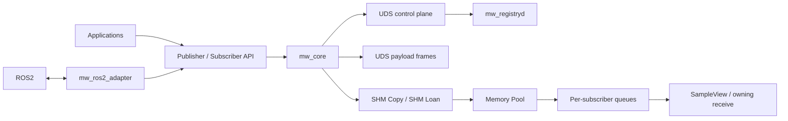

# C++ 高性能发布订阅通信中间件与 ROS2 适配框架

一个面向 Linux 机器人软件的 C++17 本机多进程 Pub/Sub 中间件。系统将版本化 Unix Domain
Socket 控制面与 UDS/Shared Memory 数据面分离，提供有界的消息所有权、故障恢复、独立的
ROS2 适配器，以及可复现的跨进程 Benchmark。

## 核心能力

- C++17 `mw_core` 动态库，支持 CMake install/export，目标名为 `mw::mw_core`
- `Context`、move-only `Publisher`/`Subscriber`、`LoanedSample` 和 `SampleView`
- 单线程 `epoll` Registry，支持 Node/Topic/端点发现和严格类型匹配
- 直接配置或 Registry 发现的 UDS 拷贝数据基线
- 预分配 POSIX SHM Memory Pool；一个 payload 可通过独立有界队列供 N 个 Subscriber 读取
- `DROP_NEWEST`、`DROP_OLDEST`、`BLOCK_WITH_TIMEOUT` Backpressure
- ALIVE/SUSPECTED/DEAD Heartbeat 租约，以及真实 `SIGKILL` 后的资源和引用恢复
- `mwctl` Node/Topic/Stats 查询
- 独立的 ROS2 Jazzy 适配器，支持 String、Twist、Image 双向桥接
- 可复现 Benchmark 与 Debug、ASan、UBSan、跨进程、故障注入和 ROS2 集成测试

## 架构



`mw_registryd` 只存储身份和端点描述，不转发业务 payload。ROS2 适配器依赖安装后的
`mw::mw_core`，Core 不包含也不链接 ROS2。详见 [架构文档](docs/ARCHITECTURE.md)，其中包含
组件、进程/线程、所有权和依赖边界。

控制面负责注册、发现、类型匹配、Heartbeat 和故障事件；数据面负责 UDS 帧或 SHM
Pool/Queue。一个 Topic 允许一个 active Publisher 向 N 个 Subscriber 扇出。协议细节见
[Protocol](docs/PROTOCOL.md) 和 [Control Plane](docs/CONTROL_PLANE.md)。

## Data Plane

- **UDS**：24 字节 sequence/timestamp Header 加 copied payload。
- **SHM Copy**：`Publisher::publish(data, size)` 将数据复制一次到预分配 Chunk。
- **SHM Loan**：应用直接填写 Pool 中的 `LoanedSample::data()`，再发布该 Chunk。
- **Receive**：`SampleView` 直接读取映射区域；`ReceivedMessage` 是 owning-copy 兼容接口。

已验证原生 SHM `LoanedSample` 到 `SampleView` 的路径不产生 middleware payload copy。整个中间件
并非 zero-copy：UDS、SHM Copy、owning receive 和 ROS2 适配器序列化都保留各自的复制
边界。详见 [Data Plane](docs/DATA_PLANE.md)。

## Publisher / Subscriber API

```cpp
mw::Context context{"camera", mw::RegistryConfig{"/tmp/mw_registry.sock"}};

mw::PublisherConfig publisher_config;
publisher_config.transport = mw::TransportType::SharedMemory;
auto publisher = context.createPublisher("/camera/image", publisher_config);

auto loan = publisher.loan(image_size);
if (!loan) {
    throw mw::MiddlewareError{loan.error(), mw::errorMessage(loan.error())};
}
fill_image(loan.data(), loan.size());
const auto result = loan.publish();
if (!result) {
    throw mw::MiddlewareError{result.error, mw::errorMessage(result.error)};
}
```

```cpp
mw::SubscriberConfig subscriber_config;
subscriber_config.socket_path = "/tmp/camera_consumer.sock";
subscriber_config.transport = mw::TransportType::SharedMemory;
subscriber_config.queue_depth = 8;
subscriber_config.overflow_policy = mw::OverflowPolicy::DropOldest;
auto subscriber = context.createSubscriber("/camera/image", subscriber_config);

auto view = subscriber.waitAndTakeView(std::chrono::seconds{1});
if (view) {
    process(view->data(), view->size());
}
```

构造和控制操作错误使用 `MiddlewareError`；发布返回 `PublishResult`；接收返回 optional，并
通过 `lastError()` 暴露错误。内存布局、生命周期、队列策略和故障边界见对应的专题文档。

## 构建与测试

```bash
cmake -S . -B .work/public/build_debug -DCMAKE_BUILD_TYPE=Debug
cmake --build .work/public/build_debug -j
ctest --test-dir .work/public/build_debug --output-on-failure
```

项目代码使用 `-Wall -Wextra -Wpedantic` 编译。CMake 选项 `ENABLE_ASAN` 和 `ENABLE_UBSAN` 可
分别生成 sanitizer 构建。

## 快速运行

构建 Release 并运行有界的 Basic demo：

```bash
cmake -S . -B .work/public/build_release -DCMAKE_BUILD_TYPE=Release
cmake --build .work/public/build_release -j
MW_BUILD_DIR="$PWD/.work/public/build_release" scripts/demo/demo_basic_pubsub.sh
```

对应的可执行文件包括 `mw_registryd`、`mw_ping_publisher`、`mw_ping_subscriber` 和 `mwctl`，
位于所选构建目录的 `bin/` 下。详见 [Demo](docs/DEMO.md)。

## mwctl

Registry 运行时可执行：

```bash
.work/public/build_release/bin/mwctl node list
.work/public/build_release/bin/mwctl topic list
.work/public/build_release/bin/mwctl topic info /ping
.work/public/build_release/bin/mwctl stats
```

非默认控制 Socket 可在命令前使用 `--registry PATH`。`stats` 输出当前 Node/Topic/
Publisher/Subscriber 数量，以及 Heartbeat、SUSPECTED、dead-node 的生命周期计数；这不是通用
Metrics exporter。

安装后可由外部 CMake 项目通过 `find_package(mw CONFIG REQUIRED)` 链接 `mw::mw_core`；完整
安装和消费者验证命令见 [Development Workflow](docs/DEVELOPMENT_WORKFLOW.md)。

## ROS2 Adapter

`mw_ros2_adapter` 是独立的 ament package，消费安装后的 Core，提供：

- `std_msgs/msg/String`
- `geometry_msgs/msg/Twist`
- `sensor_msgs/msg/Image`

三种类型的双向桥接以及 1280x720 RGB8 Image 均在 ROS2 Jazzy 上集成测试。Adapter 的
serialization/deserialization 会产生复制；它不是 custom RMW，也不是端到端 zero-copy。详见
[ROS2 Adapter](docs/ROS2_ADAPTER.md)。

## Benchmark 方法

完整矩阵对比 UDS、SHM Copy、SHM Loan 和 direct ROS2 `rmw_fastrtps_cpp`，覆盖 64 B 到 4 MiB、
1/2/4 个 Subscriber、fixed-rate latency、maximum-rate throughput 和三次 repetition。Warmup、
Discovery、Cooldown 不计入 measurement window；Payload、sequence、CPU、RSS、drop、overflow、
allocation 和 blocking 均经过校验。指标定义与复现实验见 [Benchmark](docs/BENCHMARK.md)。

## Benchmark 结果

主结果来自优化后的完整聚合：441/441 runs、147/147 groups，Git `971129a`。环境为 WSL2、
Intel i5-8300H、8 logical CPUs、GCC 13.3、Release `-O3 -DNDEBUG -g -fno-omit-frame-pointer`、
ROS2 Jazzy、`rmw_fastrtps_cpp`。以下是 1-to-1 median；latency 为 fixed-rate p50，throughput
为 maximum-rate correct delivery。

| Size | UDS p50 us / MiB/s | SHM Copy p50 us / MiB/s | SHM Loan p50 us / MiB/s | ROS2 p50 us / MiB/s |
| ---: | ---: | ---: | ---: | ---: |
| 64 B | 80.7 / 9.0 | 170.0 / 8.0 | 157.2 / 9.2 | 154.1 / 1.4 |
| 64 KiB | 97.6 / 1104.6 | 254.0 / 1070.5 | 240.4 / 1063.9 | 184.5 / 529.4 |
| 1 MiB | 742.7 / 1167.9 | 407.8 / 1405.5 | 287.7 / 1474.5 | 11205.7 / 920.1 |
| 4 MiB | 2053.4 / 1113.0 | 626.9 / 1500.0 | 274.1 / 1524.6 | 11945.9 / 947.0 |

在本次测量中，64 KiB 及以下 UDS 的 p50 最低。消息变大后 SHM 取得优势：4 MiB 时 Copy/Loan
的 p50 比 UDS 低 3.28x/7.49x，吞吐高 35%/37%。代价是 SHM mapping 增加了 RSS：4 MiB 时
Publisher+Subscriber 峰值约为 92.8 MiB，UDS 约为 16.3 MiB。

扇出会增加 aggregate delivery，但会降低 Publisher logical rate。4 MiB 1-to-4 的 aggregate
delivery 为 UDS 2562.6、Copy 4146.6、Loan 4224.7 MiB/s。direct ROS2 maximum-rate case
记录了 accounted sequence gaps，其 QoS 不宣称与自定义 Queue policy 等价。


完整 JSON/CSV、CPU 和 fanout 图表见
[`benchmark/results/reference_current/`](benchmark/results/reference_current/)。
[`reference_baseline/`](benchmark/results/reference_baseline/) 作为紧凑的优化前历史对照保留。

## 性能分析与 Profiling 证据

小消息路径曾在每次发布时同步执行 Registry Discovery。增加有界的 1 ms 复用窗口后，高频
Control round trip 大幅减少，同时保留失败时的即时失效。更高的消息速率暴露了冗余 Wake
积累，因此 Subscriber 增加了 nonblocking 的完整 Wake drain。

聚焦吞吐实验中，64 B Copy 从 10.5k 提升到 129.8k msg/s，Loan 从 10.2k 提升到 151.5k；
64 KiB 分别从 8.2k/8.5k 提升到 17.4k/17.1k。1 MiB 和 4 MiB 吞吐变化小于 1%，符合
payload/consumer 限制以及复用窗口在消息间失效的现象。

实验环境没有 `perf` 和 `strace`。Profiling 使用 Benchmark delta、`/proc` counter、100 ms
wait-channel sample 和源码检查，不声称 symbol hotspot 或 dynamic syscall ranking；证据见
[`benchmark/profiling/`](benchmark/profiling/)。

## Demo

七个可复现 Demo 覆盖 Basic Pub/Sub、4 MiB SHM、1-to-4 逻辑 Chunk sharing、三种 Backpressure、
Subscriber `SIGKILL` replacement、ROS2 String bridge 和已提交的 Benchmark evidence：

```bash
MW_BUILD_DIR="$PWD/.work/public/build_release" scripts/demo/run_all_smoke.sh
```

详见 [Demo Guide](docs/DEMO.md) 和[实际终端录屏](docs/assets/demo/terminal_demo.txt)。

## 文档导航

- 架构与协议：[Architecture](docs/ARCHITECTURE.md)、[Protocol](docs/PROTOCOL.md)、
  [Control Plane](docs/CONTROL_PLANE.md)、[Data Plane](docs/DATA_PLANE.md)
- 内存与生命周期：[Memory Model](docs/MEMORY_MODEL.md)、[Message Lifecycle](docs/MESSAGE_LIFECYCLE.md)、
  [Memory Pool](docs/MEMORY_POOL.md)、[Queues And Loaning](docs/QUEUES_AND_LOANING.md)
- 故障与适配：[Failure Model](docs/FAILURE_MODEL.md)、[ROS2 Adapter](docs/ROS2_ADAPTER.md)
- 测量与边界：[Benchmark](docs/BENCHMARK.md)、[Known Limitations](docs/KNOWN_LIMITATIONS.md)

## 已知限制

仅支持 Linux/单机；每个 Topic 只允许一个 active Publisher；不提供 durability、retransmission、
security、分布式 transport、Registry daemon 丢失后的自动 Context recovery 或 hard real-time
guarantee；ROS2 适配器仅支持 String、Twist、Image 并保留 serialization copy。参考结果来自
WSL2，未做 CPU isolation；实验环境没有 `perf`/`strace`。
详见 [Known Limitations](docs/KNOWN_LIMITATIONS.md)。

## 后续工作

后续可考虑 native Linux perf/strace、event-driven Discovery、`eventfd`、SPSC/allocator 改进、
PointCloud2、多 Publisher 语义、远程 transport 和 Registry restart recovery；这些都不是当前功能。
