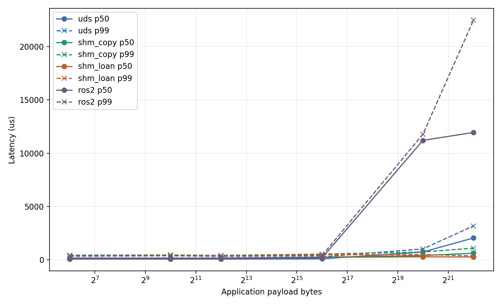
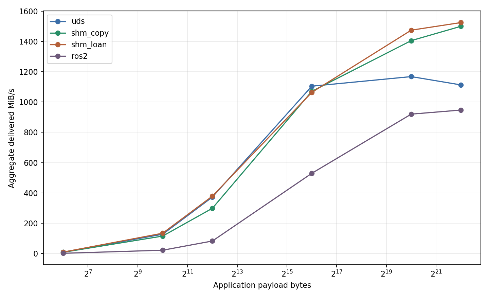

# cpp_robot_middleware

A small, explainable Linux/C++17 local multi-process Pub/Sub middleware for robotics. It separates
a versioned Unix Domain Socket control plane from selectable UDS and shared-memory data paths,
implements bounded payload ownership and failure recovery, integrates with ROS2 through a separate
adapter, and records a reproducible cross-process benchmark.

The project is intentionally not DDS, a custom ROS2 RMW, distributed middleware, production-ready,
or hard real-time.

## Why This Project

Robot software moves both tiny control messages and multi-megabyte images between processes. The
interesting work is not just calling `mmap`: discovery, type compatibility, payload lifetime,
multi-reader ownership, slow subscribers, bounded memory, process death, and honest measurement all
have to agree. This repository implements those mechanisms directly so each copy, wait, and owner
can be explained and tested.

## Key Features

- C++17 `mw_core` shared library with CMake install/export as `mw::mw_core`
- `Context`, move-only `Publisher`/`Subscriber`, `LoanedSample`, and `SampleView`
- Single-threaded `epoll` registry with node/topic/endpoint discovery and exact type matching
- Direct or registry-discovered UDS copied-payload baseline
- Preallocated POSIX SHM pools with five size classes and generation-protected chunks
- One shared payload with independent bounded queues for N subscribers
- `DROP_NEWEST`, `DROP_OLDEST`, and `BLOCK_WITH_TIMEOUT` backpressure
- ALIVE/SUSPECTED/DEAD heartbeat lease and real `SIGKILL` resource/reference recovery
- `mwctl` node/topic/stats inspection
- Independent ROS2 Jazzy adapter for String, Twist, and Image in both directions
- 441-run optimized benchmark for UDS, SHM Copy, SHM Loan, and direct ROS2
- Debug, ASan, UBSan, cross-process, fault-injection, and ROS2 integration coverage

## Architecture


`mw_registryd` stores identities and descriptors but never forwards business payloads. The ROS2
adapter depends on the installed core; the core has no ROS2 dependency. See
[Architecture](docs/ARCHITECTURE.md) for component, process/thread, ownership, and dependency
boundaries.

## Control Plane

Protocol v5 uses a 16-byte big-endian header with magic, version, opcode, request ID, and bounded
payload size. It supports node registration, topic advertisement/subscription, discovery,
heartbeat, peer-death events, node/topic queries, and registry stats. Exact topic, type name, type
hash, and transport must match; one active publisher may fan out to N subscribers.

An established SHM publisher reuses compatible discovery for at most 1 ms, with immediate refresh
after no connection, failure, disconnect, or peer-death events. See [Protocol](docs/PROTOCOL.md) and
[Control Plane](docs/CONTROL_PLANE.md).

## Data Plane

- **UDS:** a 24-byte sequence/timestamp header followed by copied payload bytes.
- **SHM Copy:** `Publisher::publish(data, size)` copies once into a preallocated chunk.
- **SHM Loan:** the application fills `LoanedSample::data()` in the pool and publishes that chunk.
- **Receive:** `SampleView` reads mapped bytes; `ReceivedMessage` is the owning-copy compatibility
  API.

The native SHM `LoanedSample` to `SampleView` path was verified to avoid middleware payload copies.
The whole middleware is not zero-copy: UDS, SHM Copy, owning receive, and ROS2 adapter serialization
retain copy boundaries. See [Data Plane](docs/DATA_PLANE.md).

## Publisher / Subscriber API

```cpp
mw::Context context{"camera", mw::RegistryConfig{"/tmp/mw_registry.sock"}};

mw::PublisherConfig publisher_config;
publisher_config.transport = mw::TransportType::SharedMemory;
auto publisher = context.createPublisher("/camera/image", publisher_config);

auto loan = publisher.loan(image_size);
fill_image(loan.data(), loan.size());
mw::PublishResult result = loan.publish();
```

```cpp
mw::SubscriberConfig subscriber_config;
subscriber_config.socket_path = "/tmp/camera_consumer.sock";
subscriber_config.transport = mw::TransportType::SharedMemory;
subscriber_config.queue_depth = 8;
subscriber_config.overflow_policy = mw::OverflowPolicy::DropOldest;
auto subscriber = context.createSubscriber("/camera/image", subscriber_config);

auto view = subscriber.waitAndTakeView(std::chrono::seconds{1});
if (view) {
    process(view->data(), view->size());
}
```

Construction/control errors use `MiddlewareError`; publish operations return `PublishResult`;
receive operations return an optional and expose `lastError()`.

## Shared Memory Layout

One publisher pool contains an encoded header, size-class metadata, a chunk directory, and aligned
`ChunkHeader + payload` storage. Default classes are 256 B, 4 KiB, 64 KiB, 1 MiB, and 4 MiB.
Each subscriber owns a separate fixed-capacity SHM queue containing only logical handles.

Cross-process chunk identity is `(pool_id, chunk_index, generation, payload_offset)`, never virtual
pointer equality. See [Memory Model](docs/MEMORY_MODEL.md) and
[Memory Pool](docs/MEMORY_POOL.md).

## Message Lifecycle And Multi-Subscriber Sharing

```text
FREE -> LOANED -> PUBLISHED -> RELEASED -> FREE
```

Publication holds a guard reference while enqueueing the same handle to accepting subscribers.
Each endpoint owns one bounded outstanding obligation. A `SampleView` releases exactly once; the
last valid release lets the publisher reclaim the generation. Unpublished loans cancel through
RAII. See [Message Lifecycle](docs/MESSAGE_LIFECYCLE.md).

## Backpressure

Every SHM subscriber selects its own queue depth and policy:

| Policy | Full-queue behavior |
| --- | --- |
| `DROP_NEWEST` | Keep queued handles and reject the new endpoint delivery |
| `DROP_OLDEST` | Release the oldest endpoint obligation and enqueue the newest |
| `BLOCK_WITH_TIMEOUT` | Wait on a monotonic deadline, then accept, close, or time out |

The queue uses a robust process-shared mutex and condition variable, not a lock-free algorithm.
See [Queues And Loaning](docs/QUEUES_AND_LOANING.md).

## Failure Model

Each registry session has a primary control connection and one heartbeat thread. Primary EOF/HUP
triggers immediate cleanup; missed leases transition ALIVE to SUSPECTED to terminal DEAD. The
registry removes exact registered names and notifies peers. Publishers repair dead-subscriber
references from bounded outstanding-handle tracking; robust queue recovery resets uncertain ring
contents and wakes blocked producers.

Publisher and subscriber replacement is tested. Existing contexts do not automatically reconnect
after registry-daemon loss. See [Failure Model](docs/FAILURE_MODEL.md).

## Build And Test

```bash
cmake -S . -B .work/phase_9/build_debug -DCMAKE_BUILD_TYPE=Debug
cmake --build .work/phase_9/build_debug -j
ctest --test-dir .work/phase_9/build_debug --output-on-failure
```

Project code compiles with `-Wall -Wextra -Wpedantic`. CMake options `ENABLE_ASAN` and
`ENABLE_UBSAN` create separate sanitizer builds.

## Quick Start

Build Release and run the bounded basic demo:

```bash
cmake -S . -B .work/phase_9/build_release -DCMAKE_BUILD_TYPE=Release
cmake --build .work/phase_9/build_release -j
scripts/demo/demo_basic_pubsub.sh
```

The underlying executables are `mw_registryd`, `mw_ping_publisher`, `mw_ping_subscriber`, and
`mwctl` under the selected build's `bin/` directory. See [Demo](docs/DEMO.md) for seven verified
scenarios and a combined smoke runner.

## mwctl

With a registry running:

```bash
.work/phase_9/build_release/bin/mwctl node list
.work/phase_9/build_release/bin/mwctl topic list
.work/phase_9/build_release/bin/mwctl topic info /ping
.work/phase_9/build_release/bin/mwctl stats
```

Use `--registry PATH` before the command for a non-default socket. `stats` reports current
node/topic/publisher/subscriber counts and lifetime heartbeat, suspected-transition, and dead-node
counters. Per-publication drop/block/allocation results remain in `PublishResult` and benchmark
artifacts; this is not a general metrics exporter.

## Install / External Consumer

```bash
cmake --install .work/phase_9/build_release --prefix .work/phase_9/install
cmake -S examples/external_consumer -B .work/phase_9/external_consumer \
  -DCMAKE_PREFIX_PATH="$PWD/.work/phase_9/install"
cmake --build .work/phase_9/external_consumer -j
.work/phase_9/external_consumer/mw_external_consumer
```

External CMake projects use `find_package(mw CONFIG REQUIRED)` and link `mw::mw_core`.

## ROS2 Adapter

`mw_ros2_adapter` is a separate ament package consuming the installed core. It provides
`ros2_to_mw_bridge` and `mw_to_ros2_bridge` for:

- `std_msgs/msg/String`
- `geometry_msgs/msg/Twist`
- `sensor_msgs/msg/Image`

Both directions and a 1280x720 RGB8 Image are integration-tested on ROS2 Jazzy. Adapter
serialization/deserialization introduces copies; this is not a custom RMW or end-to-end zero-copy
path. See [ROS2 Adapter](docs/ROS2_ADAPTER.md).

## Benchmark Methodology

The complete matrix compares UDS, SHM Copy, SHM Loan, and direct ROS2
`rmw_fastrtps_cpp` across 64 B, 1 KiB, 4 KiB, 64 KiB, 1 MiB, and 4 MiB; 1-to-1/2/4 independent
subscriber processes; fixed-rate latency and maximum-rate throughput; and three repetitions.
Warmup/discovery and cooldown are outside the five-second measurement window. Payload bytes,
monotonic timestamps, sequence, CPU, RSS, drops, overflow, allocation, and blocking are validated.

The direct ROS2 baseline uses `UInt8MultiArray` and does not pass through the adapter. See
[Benchmark](docs/BENCHMARK.md) for fairness and metric definitions.

## Benchmark Results

Primary results are the optimized Phase 8.1 aggregate: 441/441 valid runs and 147/147 valid groups
at Git `971129a`. Environment: WSL2, Intel i5-8300H, 8 logical CPUs, GCC 13.3, Release
`-O3 -DNDEBUG -g -fno-omit-frame-pointer`, ROS2 Jazzy, `rmw_fastrtps_cpp`. Values below are
1-to-1 medians; latency is fixed-rate p50 and throughput is maximum-rate correct delivery.

| Size | UDS p50 us / MiB/s | SHM Copy p50 us / MiB/s | SHM Loan p50 us / MiB/s | ROS2 p50 us / MiB/s |
| ---: | ---: | ---: | ---: | ---: |
| 64 B | 80.7 / 9.0 | 170.0 / 8.0 | 157.2 / 9.2 | 154.1 / 1.4 |
| 64 KiB | 97.6 / 1104.6 | 254.0 / 1070.5 | 240.4 / 1063.9 | 184.5 / 529.4 |
| 1 MiB | 742.7 / 1167.9 | 407.8 / 1405.5 | 287.7 / 1474.5 | 11205.7 / 920.1 |
| 4 MiB | 2053.4 / 1113.0 | 626.9 / 1500.0 | 274.1 / 1524.6 | 11945.9 / 947.0 |

UDS retained the lowest p50 through 64 KiB on this run. At 64 B, message rates were 148.0k/s UDS,
130.8k/s Copy, and 151.4k/s Loan. SHM crossed over for large messages: at 4 MiB, Copy/Loan p50 was
3.28x/7.49x lower than UDS and throughput was 35%/37% higher. SHM mappings also raised RSS: total
publisher+subscriber peak was about 92.8 MiB for 4 MiB SHM versus 16.3 MiB UDS.

Fanout increases aggregate delivery while reducing logical publisher rate. At 4 MiB 1-to-4,
aggregate delivery was 2562.6 MiB/s UDS, 4146.6 Copy, and 4224.7 Loan, with four subscriber
processes consuming additional CPU and RSS. Direct ROS2 maximum-rate cases recorded accounted
sequence gaps; its QoS is not claimed equivalent to the custom queue policies.





Full JSON/CSV and CPU/fanout charts are in
[`benchmark/results/phase8_1_reference/`](benchmark/results/phase8_1_reference/). The unoptimized
[`phase8_reference/`](benchmark/results/phase8_reference/) is retained only as historical evidence.

## Performance Analysis / Profiling

Phase 8.1 found that small-message SHM publication synchronously resolved registry discovery for
every message. A bounded 1 ms reuse window removed most high-rate control round trips while
retaining immediate failure invalidation. The higher rate then exposed redundant wake accumulation;
the subscriber now drains complete redundant wake frames nonblockingly.

Focused throughput improved 64 B Copy from 10.5k to 129.8k msg/s and Loan from 10.2k to 151.5k;
64 KiB improved from 8.2k to 17.4k and 8.5k to 17.1k. 1 MiB and 4 MiB throughput stayed within
1%, consistent with payload/consumer limits and the reuse window expiring between messages.

`perf` and `strace` were unavailable. The report uses benchmark deltas, `/proc` CPU/fault/context
switch counters, 100 ms wait-channel samples, and source inspection; it does not claim symbol or
dynamic syscall rankings. See [Phase 8.1 report](docs/reports/PHASE_8_1_REPORT.md) and
[`benchmark/profiling/`](benchmark/profiling/).

## Demo

Seven reproducible demos cover basic Pub/Sub, 4 MiB SHM, 1-to-4 logical chunk sharing, all three
backpressure policies, subscriber `SIGKILL` replacement, ROS2 String bridging, and committed
benchmark evidence:

```bash
scripts/demo/run_all_smoke.sh
```

See [Demo Guide](docs/DEMO.md) and the
[actual terminal capture](docs/assets/demo/terminal_demo.txt).

## Documentation

- [Architecture](docs/ARCHITECTURE.md)
- [Protocol](docs/PROTOCOL.md)
- [Control Plane](docs/CONTROL_PLANE.md)
- [Data Plane](docs/DATA_PLANE.md)
- [Memory Model](docs/MEMORY_MODEL.md)
- [Message Lifecycle](docs/MESSAGE_LIFECYCLE.md)
- [Memory Pool](docs/MEMORY_POOL.md)
- [Queues And Loaning](docs/QUEUES_AND_LOANING.md)
- [Failure Model](docs/FAILURE_MODEL.md)
- [ROS2 Adapter](docs/ROS2_ADAPTER.md)
- [Benchmark](docs/BENCHMARK.md)
- [Known Limitations](docs/KNOWN_LIMITATIONS.md)
- [Project Completion Checklist](docs/PROJECT_COMPLETION_CHECKLIST.md)
- [Interview Guide](docs/INTERVIEW_GUIDE.md)
- [Resume Guide](docs/RESUME.md)
- [Engineering Reports](docs/reports/)

## Known Limitations

Linux/single-host only; one active publisher per topic; no durability, retransmission, security, or
distributed transport; no automatic context recovery after registry-daemon loss; no hard real-time
guarantee; exact local pthread/atomic ABI assumptions; ROS2 adapter limited to three types with
serialization copies; WSL2 reference results without CPU isolation; perf/strace unavailable during
Phase 8.1. See [Known Limitations](docs/KNOWN_LIMITATIONS.md).

## Future Work

Possible but **not implemented** work includes native-Linux perf/strace profiling, event-driven
discovery, `eventfd`, evidence-driven SPSC/allocator changes, PointCloud2, multi-publisher
semantics, remote transport, CI, and registry restart recovery. These are not current features.

## License

No project license has been selected yet.
