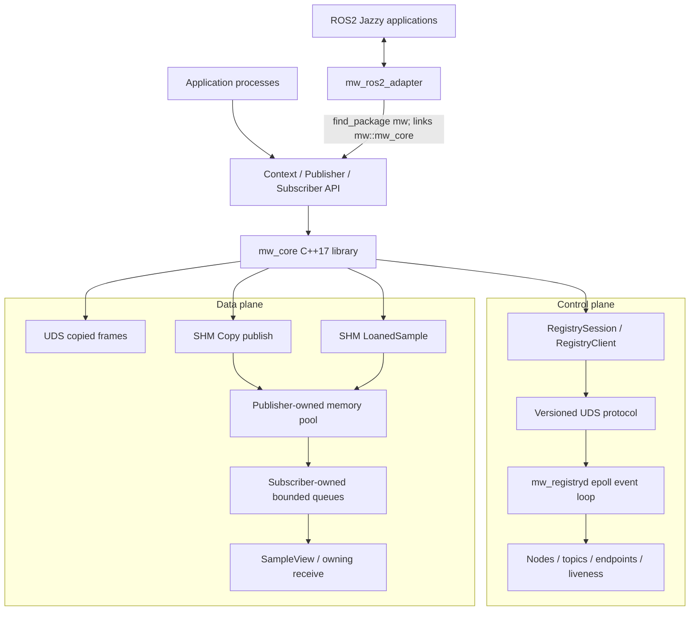

# 架构

## 系统概览

`cpp_robot_middleware` 是 Linux 本机多进程 Publish/Subscribe 系统。其 C++17 Core 将
Registry/Discovery 流量与 payload delivery 分离，每个 Topic 支持一个 active Publisher 和
N 个 Subscriber。



Registry 从不转发业务 payload。ROS2 Adapter 是依赖已安装 Core 的独立 package；`mw_core`
不包含也不链接 `rclcpp`。

## 组件边界

| 组件 | 职责 | 明确不负责 |
| --- | --- | --- |
| `mw_core` | Public API、UDS/SHM transport、Pool/Queue mapping、Lifecycle、Discovery client | ROS2 类型、分布式 Discovery、Persistence |
| `mw_registryd` | Node/Topic/Endpoint 状态、Discovery、Heartbeat、精确的崩溃清理 | Payload 转发、应用 Callback、Pool 分配 |
| `Publisher` | Discovery reconciliation、Sequence 分配、Pool 分配、Fanout、引用所有权 | Subscriber 的应用工作 |
| `Subscriber` | Listener/Queue 所有权、接收校验、Pool view、Release delivery | 修改 Pool free-list |
| `mwctl` | 通过 Control Protocol 只读查询 Node/Topic/Stats | 直接访问 daemon memory 或 SHM |
| ROS2 Adapter | 带类型的 ROS serialization 和双向桥接 | Custom RMW、DDS replacement、zero-copy ROS path |
| Benchmark | 可重复的进程编排、校验、CPU/RSS 采样、聚合和图表 | 生产 telemetry 或 scheduler control |

## Control Plane

每个启用 Registry 的 `Context` 拥有一个共享 `RegistrySession`。Session 在 primary UDS
connection 上注册一个 Node，并拥有第二条 UDS connection 和一个 Heartbeat thread。构造
Publisher/Subscriber 时会 advertise/subscribe Endpoint；Publisher 同步 resolve 兼容的
Subscriber。已建立的 SHM Discovery 最多复用 1 ms，发生故障或 Peer event 时立即失效。

`mw_registryd` 拥有一个 listening socket 和单线程 `epoll` loop。`RegistryState` 不包含
Socket I/O，只负责执行单 Publisher、类型、Transport、所有权和 Liveness 规则。详见
[协议](PROTOCOL.md)和 [Control Plane](CONTROL_PLANE.md)。

## Data Plane

所有正常 publish 和 receive 操作都在 Caller thread 上执行，不存在 Data worker thread。

- UDS 向每个已发现 Subscriber 发送 24-byte Header，随后发送 copied payload。
- SHM Copy 分配一个已有 Chunk，并执行一次 application-buffer-to-chunk copy。
- SHM Loan 将已分配 Chunk 暴露给 Publisher 应用，然后把同一个逻辑 Chunk 加入 Subscriber Queue。
- 每个 SHM Subscriber 拥有独立的固定容量 Queue，其中只保存 `ChunkHandle`。
- Direct UDS frame 或 SHM Wake/Release metadata 使用 Publisher-to-Subscriber Data Socket。

经过验证的 `LoanedSample` 到 `SampleView` 路径不会产生 middleware payload copy。该结论
不适用于 UDS、普通 SHM `publish()`、owning `ReceivedMessage` 或 ROS2 Adapter。

## 资源所有权

| 资源 | Owner | Peer 访问方式 | 崩溃处理权 |
| --- | --- | --- | --- |
| Registry listener 和 Client fd | `mw_registryd` / 各 Client RAII wrapper | 仅通过 Protocol | Kernel close 加 Registry cleanup |
| Publisher SHM Pool name 和 writable mapping | SHM `Publisher` | Subscriber read-only mapping | Registry unlink 精确的 advertised name |
| Pool free list 和 Chunk refcount | 仅 SHM `Publisher` | Subscriber 校验/读取 | Publisher 清理 dead Endpoint obligation |
| Subscriber SHM Queue name/mapping | SHM `Subscriber` | Publisher read-write mapping | Registry robust-close 并 unlink 精确 Queue |
| Subscriber Data Socket path | `Subscriber` listener | Publisher 连接 | Registry 移除精确注册的 Socket |
| Loaned Chunk generation | move-only `LoanedSample` | Publish 前无 Peer 访问 | Publisher 进程拥有整个 Pool |
| 已发布的 Subscriber reference | move-only `SampleView` | Publisher 跟踪匹配 obligation | Dead Subscriber event 释放 obligation |

Pointer 仅在进程内有效。跨进程身份由 `pool_id`、`chunk_index`、`generation` 和
`payload_offset` 组成。

## 进程与线程模型

```text
mw_registryd process
  main thread: epoll, protocol dispatch, liveness evaluation, exact cleanup

publisher/subscriber process
  application thread(s): construct endpoints, publish, take, queue/pool work
  one RegistrySession heartbeat thread per Context session

ROS2 bridge process
  rclcpp executor thread: ROS callback or timer polling
  RegistrySession heartbeat thread from mw_core
```

Public Endpoint API 面向串行化的应用调用；Registry Client 不会 multiplex 来自多个应用线程的
并发请求。

## 依赖方向

```text
mw_ros2_adapter -> installed mw::mw_core -> C++17 / POSIX / pthread
mw_registryd    -> mw::mw_core protocol and IPC support
mwctl           -> mw::mw_core registry client
benchmark       -> public core API (or direct ROS2 baseline)
```

direct ROS2 Benchmark 不经过 Adapter；它使用 ROS2 Jazzy 和 `rmw_fastrtps_cpp` 作为外部对照。

## 错误边界

Protocol input 具有长度上限并经过显式 decode。Pool/Queue descriptor 在 mapping 或访问前必须
通过校验。Public operation 返回 `ErrorCode`、`PublishResult`、空 optional 加
`lastError()`，或在构造/Control operation 中抛出 `MiddlewareError`。RAII destructor 执行
有界的 best-effort cleanup，不会虚构针对主机或 Registry 故障的恢复能力。

## 范围

已实现范围为单台 Linux 主机、每个 Topic 一个 active Publisher、N 个 Subscriber、volatile
delivery 和普通 OS scheduling。完整边界见[已知限制](KNOWN_LIMITATIONS.md)，证据见
[项目完成度清单](PROJECT_COMPLETION_CHECKLIST.md)。
