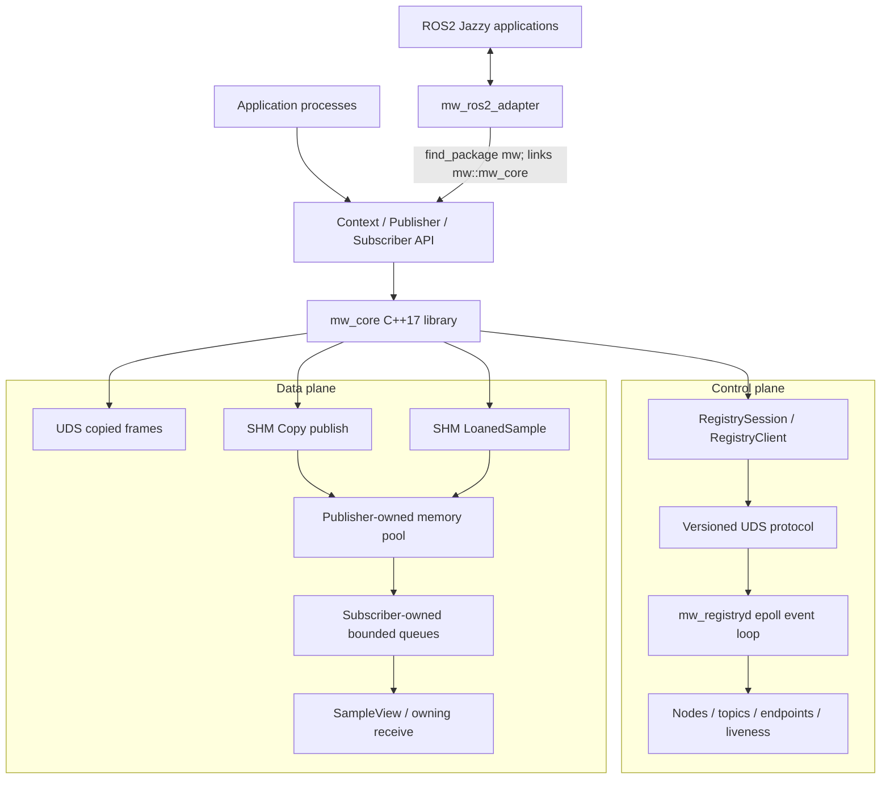

# Architecture

## System Overview

`cpp_robot_middleware` is a Linux-local, multi-process publish/subscribe system. Its C++17 core
separates registry/discovery traffic from payload delivery and supports one active publisher and N
subscribers per topic.



The registry never forwards business payloads. The ROS2 adapter is a separate package that depends
on the installed core; `mw_core` does not include or link `rclcpp`.

## Component Boundaries

| Component | Responsibility | Explicit non-responsibility |
| --- | --- | --- |
| `mw_core` | Public API, UDS/SHM transports, pool/queue mapping, lifecycle, discovery client | ROS2 types, distributed discovery, persistence |
| `mw_registryd` | Node/topic/endpoint state, discovery, heartbeat, exact crash cleanup | Payload forwarding, application callbacks, pool allocation |
| `Publisher` | Discovery reconciliation, sequence assignment, pool allocation, fanout, reference ownership | Subscriber application work |
| `Subscriber` | Listener/queue ownership, receive validation, pool view, release delivery | Pool free-list mutation |
| `mwctl` | Read-only node/topic/stats queries over the control protocol | Direct daemon-memory or SHM access |
| ROS2 adapter | Typed ROS serialization and bidirectional bridging | Custom RMW, DDS replacement, zero-copy ROS path |
| Benchmark | Repeatable process orchestration, validation, CPU/RSS sampling, aggregation, charts | Production telemetry or scheduler control |

## Control Plane

Each registry-enabled `Context` owns a shared `RegistrySession`. The session registers one node on
a primary UDS connection and owns a second UDS connection plus one heartbeat thread. Publisher and
subscriber construction advertises/subscribes endpoints; publishers synchronously resolve
compatible subscribers. Established SHM discovery is reused for at most 1 ms and invalidated
immediately on failure or peer events.

`mw_registryd` owns one listening socket and one single-threaded `epoll` loop. `RegistryState`
contains no socket I/O; it applies one-publisher, type, transport, ownership, and liveness rules.
See [PROTOCOL.md](PROTOCOL.md) and [CONTROL_PLANE.md](CONTROL_PLANE.md).

## Data Plane

The caller's thread performs every normal publish and receive operation. There are no data worker
threads.

- UDS sends a 24-byte header followed by copied payload bytes to each discovered subscriber.
- SHM Copy allocates a preexisting chunk and performs one application-buffer-to-chunk copy.
- SHM Loan exposes the allocated chunk to the publisher application, then enqueues that same
  logical chunk to subscribers.
- Each SHM subscriber has an independent fixed-capacity queue containing only `ChunkHandle` values.
- Direct UDS frames or SHM wake/release metadata use publisher-to-subscriber data sockets.

The verified `LoanedSample` to `SampleView` path avoids middleware payload copies. That statement
does not apply to UDS, ordinary SHM `publish()`, owning `ReceivedMessage`, or the ROS2 adapter.

## Resource Ownership

| Resource | Owner | Peer access | Crash authority |
| --- | --- | --- | --- |
| Registry listener and client fds | `mw_registryd` / each client RAII wrapper | Protocol only | Kernel close plus registry cleanup |
| Publisher SHM pool name and writable mapping | SHM `Publisher` | Subscribers map read-only | Registry unlinks exact advertised name |
| Pool free lists and chunk refcounts | SHM `Publisher` only | Subscribers validate/read | Publisher drains dead endpoint obligations |
| Subscriber SHM queue name/mapping | SHM `Subscriber` | Publisher maps read-write | Registry robust-closes and unlinks exact queue |
| Subscriber data socket path | `Subscriber` listener | Publisher connects | Registry removes exact registered socket |
| Loaned chunk generation | Move-only `LoanedSample` | None before publish | Publisher process owns whole pool |
| Published subscriber reference | Move-only `SampleView` | Publisher tracks matching obligation | Dead subscriber event releases obligation |

Pointers are process-local. Cross-process identity is the tuple `pool_id`, `chunk_index`,
`generation`, and `payload_offset`.

## Process And Thread Model

```text
mw_registryd process
  main thread: epoll, protocol dispatch, liveness evaluation, exact cleanup

publisher/subscriber process
  application thread(s): construct endpoints, publish, take, queue/pool work
  one RegistrySession heartbeat thread per Context session

ROS2 bridge process
  rclcpp executor thread: ROS callback or timer polling
  RegistrySession heartbeat thread from mw_core
```

The public endpoint APIs are designed for serialized application use; the registry client does not
multiplex simultaneous requests from multiple application threads.

## Dependency Direction

```text
mw_ros2_adapter -> installed mw::mw_core -> C++17 / POSIX / pthread
mw_registryd    -> mw::mw_core protocol and IPC support
mwctl           -> mw::mw_core registry client
benchmark       -> public core API (or direct ROS2 baseline)
```

The direct ROS2 benchmark does not pass through the adapter. It is an external comparison using
ROS2 Jazzy and `rmw_fastrtps_cpp`.

## Error Boundaries

Protocol inputs are length-bounded and explicitly decoded. Pool/queue descriptors are validated
before mapping or access. Public operations return `ErrorCode`, `PublishResult`, an empty optional
plus `lastError()`, or throw `MiddlewareError` during construction/control operations. RAII
destructors perform bounded best-effort cleanup and do not invent recovery for host or registry
failure.

## Scope

Implemented scope is one Linux host, one active publisher per topic, N subscribers, volatile
delivery, and normal OS scheduling. See [KNOWN_LIMITATIONS.md](KNOWN_LIMITATIONS.md) for the full
boundary and [PROJECT_COMPLETION_CHECKLIST.md](PROJECT_COMPLETION_CHECKLIST.md) for evidence.
