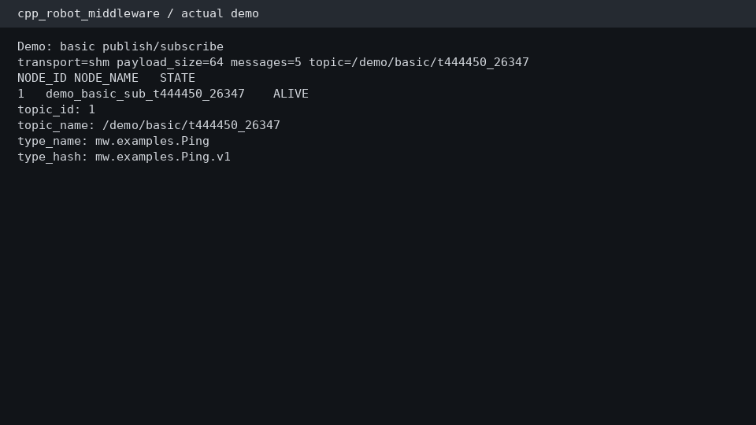

# Reproducible Demos

## Prerequisites

Run from the repository root on Linux. Build the core Release binaries under `.work/public/`:

```bash
cmake -S . -B .work/public/build_release -DCMAKE_BUILD_TYPE=Release
cmake --build .work/public/build_release -j
```

Scripts default to that build directory. Override it with `MW_BUILD_DIR=/absolute/path` when
needed. Every script uses unique names, bounded waits, exact child PIDs, and an EXIT cleanup trap.
No script uses broad `pkill` or wildcard `/dev/shm` cleanup.

## Demo 1: Basic Pub/Sub

```bash
scripts/demo/demo_basic_pubsub.sh
```

Runs a registry, one SHM publisher, and one subscriber for five deterministic 64-byte messages.
It prints live `mwctl` node/topic/stats state and verifies sent/received counts, sequence, and
payload correctness.

## Demo 2: Large Message

```bash
scripts/demo/demo_large_message.sh
```

Transfers three 4 MiB messages through the ordinary SHM Copy API and validates exact payload bytes
and sequence. This is a correctness demo, not a new benchmark; measured performance comes from the
committed optimized reference.

## Demo 3: Multi-Subscriber Sharing

```bash
scripts/demo/demo_multi_subscriber.sh
```

Runs one publisher and four independent subscribers. All four outputs must report the same
`pool_id`, `chunk_index`, `generation`, and `payload_offset`, proving one logical chunk was shared.
Virtual pointer equality is neither printed nor claimed.

## Demo 4: Backpressure

```bash
scripts/demo/demo_backpressure.sh
```

Uses the existing benchmark endpoints with a depth-2 queue and an intentionally slow subscriber.
It executes `DROP_NEWEST`, `DROP_OLDEST`, and `BLOCK_WITH_TIMEOUT`, then prints actual delivered
rate, drop/overflow counts, blocked operations, and blocked time from the generated aggregate.

## Demo 5: Crash Recovery

```bash
scripts/demo/demo_crash_recovery.sh
```

The script starts one subscriber, prints its live registry record, sends `SIGKILL` only to that
exact PID, waits for removal, starts a replacement on the same endpoint path, and verifies a new
publication. The deeper outstanding-view and blocked-producer cases remain covered by the
integration tests.

## Demo 6: ROS2 Adapter

First install the core and build the adapter:

```bash
cmake --install .work/public/build_release --prefix .work/public/install
source /opt/ros/jazzy/setup.bash
colcon --log-base .work/public/ros2/log build \
  --base-paths ros2_adapter \
  --build-base .work/public/ros2/build \
  --install-base .work/public/ros2/install \
  --cmake-args -DCMAKE_BUILD_TYPE=Release \
  "-DCMAKE_PREFIX_PATH=$PWD/.work/public/install;/opt/ros/jazzy"
```

Then run:

```bash
scripts/demo/demo_ros2_adapter.sh
```

It sends a real `std_msgs/msg/String` over ROS2 input, through ROS2-to-middleware serialization,
the native SHM topic, middleware-to-ROS2 deserialization, and a distinct ROS2 output topic. The
script verifies the echoed payload. Twist and a 1280x720 RGB8 Image are covered by adapter tests.

## Demo 7: Benchmark Evidence

```bash
scripts/demo/demo_benchmark.sh
```

This parses `benchmark/results/phase8_1_reference/summary.json`; it does not rerun the full matrix.
It prints selected p50 latency, throughput, message rate, and backpressure medians and lists all
four committed chart paths.

## Automated Smoke

Run all non-ROS demos:

```bash
scripts/demo/run_all_smoke.sh
```

Include the separately built/sourced ROS2 demo:

```bash
scripts/demo/run_all_smoke.sh --with-ros2
```

## Actual Capture

An actual successful basic demo capture is stored at
[assets/demo/terminal_demo.txt](assets/demo/terminal_demo.txt). When Pillow is available, the
transcript is rendered without altering its content:

```bash
python3 scripts/demo/render_terminal_gif.py \
  docs/assets/demo/terminal_demo.txt docs/assets/demo/demo.gif
```


