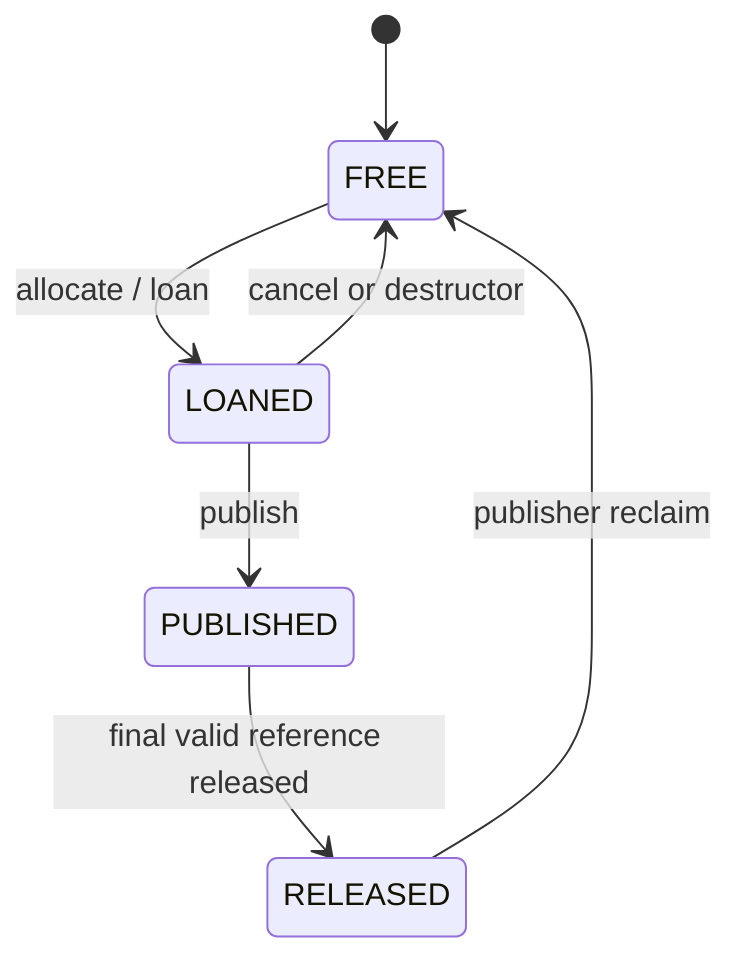

# Message Lifecycle

## State Machine

`DELIVERED` is an endpoint event rather than a stored chunk state: a subscriber dequeues a
published handle and owns its reference through `SampleView`.

## Ordinary SHM Publish

1. Resolve/reconcile compatible subscribers before allocation.
2. Pop the smallest fitting FREE chunk and change it to LOANED.
3. Copy the application payload once and write sequence/timestamp metadata.
4. Publish with one guard reference.
5. Add a tentative reference and enqueue the same handle for each accepting subscriber.
6. Return references for policy rejection, timeout, close, or failed notification.
7. Release the guard after all endpoint decisions.

If no endpoint accepts the message, the guard release lets the publisher reclaim it.

## Loan Without Publish

`LoanedSample` is move-only. Its destructor cancels an active LOANED generation and returns it to
the free list. A moved-from sample is inert. UDS returns `UnsupportedTransport` instead of
pretending a heap buffer is a loan.

## Loan Then Publish

The application writes only the payload range returned by `data()`. The first `publish()` consumes
the loan whether publication succeeds or fails. A second publish returns `InvalidState`. Successful
publication uses the same guard/enqueue/reference protocol as ordinary publish without the initial
application-buffer copy.

## Multi-Subscriber Reference Count

One payload chunk is allocated regardless of subscriber count. Each successful endpoint enqueue
owns one reference to the same logical identity. The publisher tracks each obligation separately,
so independent subscriber completion, drop policy, disconnect, or death can release exactly its
own reference.

The guard prevents a fast subscriber from reducing the new generation to zero while the publisher
is still adding references for later subscribers.

## SampleView Lifetime

`SampleView` is move-only and read-only. It retains both the read-only pool mapping and a shared
release-channel context, so it may outlive the `Subscriber` object. Its non-throwing destructor
sends one release. The publisher validates all handle fields and generation before decrementing.

The owning `waitAndTake()` compatibility API copies bytes from a temporary view into
`ReceivedMessage`, then releases the view.

## Backpressure Transitions

### DROP_NEWEST

The full queue remains unchanged. The new tentative endpoint reference is returned. If no endpoint
accepts, publication reports `QueueFull`.

### DROP_OLDEST

Under the queue mutex, the oldest handle is removed and the new handle inserted. The displaced
endpoint obligation is returned and may reclaim its old chunk. The new publication succeeds for
that endpoint.

### BLOCK_WITH_TIMEOUT

The publisher waits on a process-shared condition variable using a monotonic deadline. Dequeue,
queue close, or timeout ends the wait. Timeout returns the tentative reference and is reported in
`PublishResult`.

## Subscriber Crash

Control EOF/HUP or heartbeat death removes the subscriber. The registry robust-opens and closes its
queue, broadcasts blocked producers, unlinks exact names, and sends a peer event. The publisher
drains the endpoint's outstanding vector, including a view that disappeared with the process.

Robust mutex recovery resets uncertain ring contents to empty. Publisher outstanding tracking, not
the possibly interrupted queue contents, is the reference-repair authority.

## Publisher Crash

The registry removes the endpoint and pool name and notifies subscribers. Existing mappings/views
remain locally valid until released, but new queue entries for that pool are discarded. A
replacement publisher creates a new pool identity and can reconnect after cleanup.

## Error Protection

Invalid state transitions, double publish, duplicate release, stale generation, wrong pool/index/
offset, corrupt descriptors, and premature reclaim return explicit errors. Host failure, arbitrary
shared-memory corruption, and registry-daemon restart are not repaired.

See [QUEUES_AND_LOANING.md](QUEUES_AND_LOANING.md) for queue synchronization and
[FAILURE_MODEL.md](FAILURE_MODEL.md) for process recovery.
