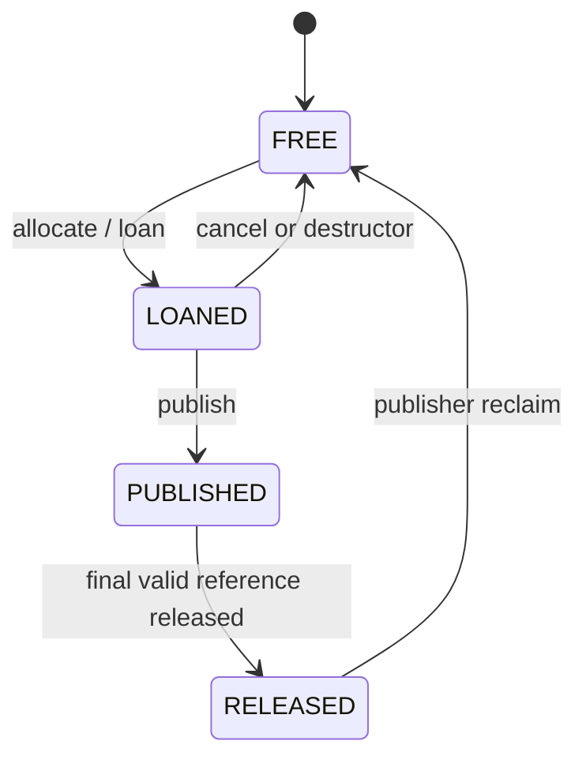

# 消息生命周期

## State Machine

`DELIVERED` 是 Endpoint event，而不是保存的 Chunk state：Subscriber dequeue 一个 Published
Handle，并通过 `SampleView` 持有其 reference。

## 普通 SHM Publish

1. 分配前 resolve/reconcile 兼容 Subscriber。
2. 从能够容纳 payload 的最小 class 中 pop 一个 FREE Chunk，并改为 LOANED。
3. 复制一次 application payload，写入 sequence/timestamp metadata。
4. 使用一个 guard reference 执行 publish。
5. 为每个接受消息的 Subscriber 增加 tentative reference，并 enqueue 相同 Handle。
6. Policy rejection、timeout、close 或 notification 失败时归还 reference。
7. 所有 Endpoint decision 完成后释放 guard。

如果没有 Endpoint 接受消息，释放 guard 后 Publisher 即可回收 Chunk。

## Loan 后不 Publish

`LoanedSample` 是 move-only object。析构时会 cancel 活动的 LOANED generation，并将其放回
free list。Moved-from sample 不再生效。UDS 返回 `UnsupportedTransport`，不会假装 Heap buffer
是一个 Loan。

## Loan 后 Publish

应用只能写入 `data()` 返回的 payload range。第一次 `publish()` 无论成功或失败都会 consume
Loan；第二次 Publish 返回 `InvalidState`。成功 Publish 使用与普通 Publish 相同的
guard/enqueue/reference Protocol，但不执行最初的 application-buffer copy。

## Multi-Subscriber Reference Count

无论 Subscriber 数量多少，只分配一个 payload Chunk。每次成功的 Endpoint enqueue 都持有指向
同一逻辑 identity 的一个 reference。Publisher 分别跟踪每个 obligation，因此各 Subscriber
独立完成、Drop Policy、Disconnect 或死亡时，都只能释放自己的 reference。

Guard 可防止快速 Subscriber 在 Publisher 仍为后续 Subscriber 增加 reference 时，把新
generation 的 reference 降为零。

## SampleView 生命周期

`SampleView` 是 move-only 且 read-only。它同时保留 read-only Pool mapping 和 shared
release-channel context，因此可以比 `Subscriber` object 存活更久。其 non-throwing
destructor 会发送一次 release。Publisher 在递减前校验全部 Handle field 和 generation。

兼容的 owning `waitAndTake()` API 会从临时 View 把 byte 复制进 `ReceivedMessage`，然后释放
该 View。

## Backpressure Transition

### DROP_NEWEST

满 Queue 保持不变，并归还新的 tentative Endpoint reference。如果没有 Endpoint 接受，
Publish 报告 `QueueFull`。

### DROP_OLDEST

在 Queue mutex 保护下移除最旧 Handle，并插入新 Handle。被替换的 Endpoint obligation 会被归还，
可能触发旧 Chunk 回收。新 Publish 对该 Endpoint 成功。

### BLOCK_WITH_TIMEOUT

Publisher 使用 monotonic deadline 在 process-shared condition variable 上等待。Dequeue、
Queue close 或 timeout 会结束等待。Timeout 会归还 tentative reference，并记录在
`PublishResult` 中。

## Subscriber 崩溃

Control EOF/HUP 或 Heartbeat death 会移除 Subscriber。Registry robust-open/close 其 Queue，
broadcast 被阻塞的 Producer，unlink 精确 Name，并发送 Peer event。Publisher 清理该 Endpoint
的 outstanding vector，包括随进程消失的 View。

Robust mutex recovery 会把不确定的 Ring content 重置为空。Reference repair 的权威来源是
Publisher outstanding tracking，而不是可能被中断的 Queue content。

## Publisher 崩溃

Registry 移除 Endpoint 和 Pool name，并通知 Subscriber。现有 mapping/view 在本地释放前保持
有效，但属于该 Pool 的新 Queue entry 会被丢弃。Replacement Publisher 创建新的 Pool identity，
并可在 cleanup 后重新连接。

## 错误保护

无效 State transition、double publish、duplicate release、stale generation、错误的
Pool/Index/Offset、corrupt descriptor 和过早 reclaim 都会返回明确错误。系统不修复主机故障、
任意 Shared Memory corruption 或 Registry daemon restart。

Queue synchronization 见 [Queue 与 Loan](QUEUES_AND_LOANING.md)，进程恢复见
[故障模型](FAILURE_MODEL.md)。
